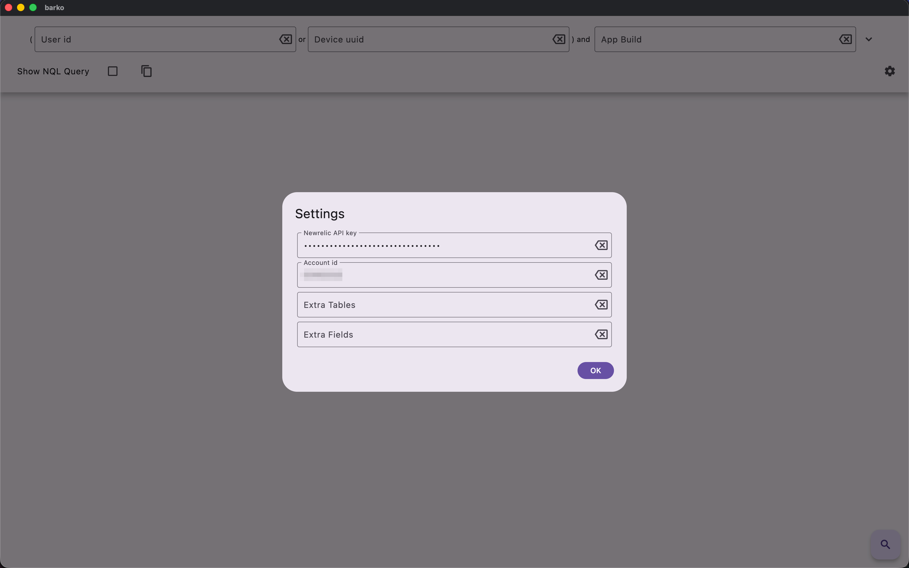
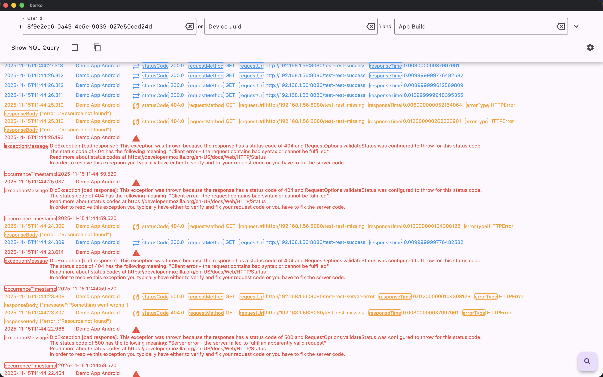
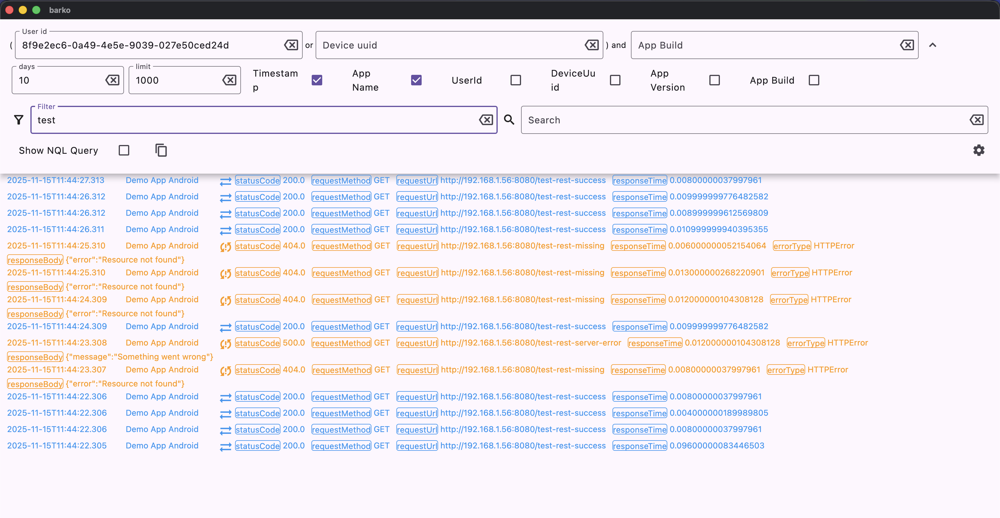
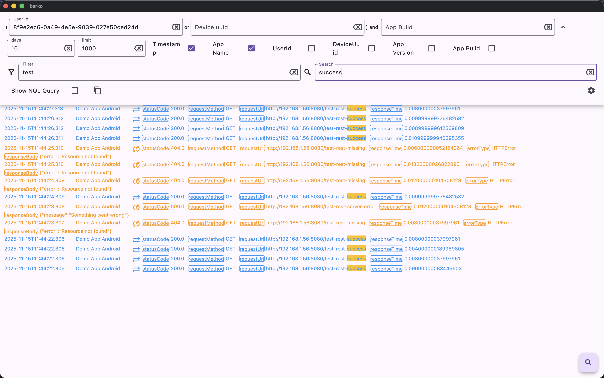

# barko

Barko is a cross‑platform Unofficial New Relic log viewer designed for mobile developers.
Connect your app's logs from New Relic and explore them with filtering,
search, and real‑time updates. Stay productive and let Barko — your loyal
corgi detective — help you sniff out issues instantly.

Made for developers who love good logs (and good dogs)

Disclaimer: This project is an independent, unofficial tool that uses the public New Relic REST API.
It is not affiliated with New Relic, Inc., and not endorsed or certified by them.
Users are responsible for complying with New Relic’s API Terms of Use and rate limits.

## License

This project is licensed under the MIT License — see the [LICENSE](./LICENSE) file for details.

## Getting Started

To get started you'll need a New Relic API Key.
To get one you need to:

- go to your New Relic portal
- tap on for profile
- go to API Keys
- create key
- copy the API Key

You will also need to know your account id. You can get it from your newrelic portal url. Locate the
account = <account-id> query param, that's your account id.

Once you have your account id and an API Key you can start using Barko.

Open the app and go to the settings screen:

Enter the API Key and the account id and tap ok.

Now you are ready to use Barko.

## How to use Barko

Barko centers on looking at logs for a single user or device.
Let's say that a user in production is having issues and you know that user's userId.
Now you are ready to start troubleshooting with Barko, just type in the userId and hit the search
button.

For this to work your mobile app needs to set the "User Id" in the New Relic SDK.

### Filtering

You can use the "Filter" field to only display entries that have the keywords typed in that field.

### Search

Keywords typed in the "Search" field will by highlighted in yellow in the current logs.

